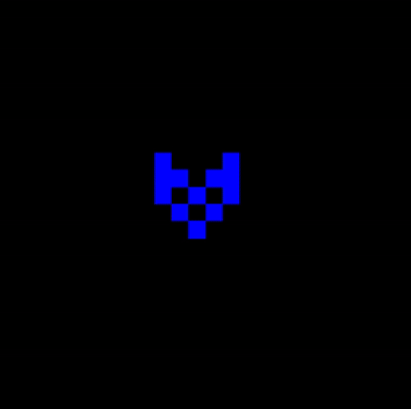

# Game of Life on the GPU with Rust

Game of Life running on the GPU and completely written in Rust, including the GPU code.

It uses the amdgpu Rust target and therefore only runs on AMD GPUs.
There is a flurry of interesting low-level details and hacks in the code, read on if you are interested.

## Build & Run

How to build and run:
1. Install **nightly** Rust in a way of your choice (rustup is recommended)
1. Setup **`ROCM_PATH`** as described in [amdgpu-rs](https://github.com/Flakebi/amdgpu-rs)
    - Alternatively, use the nix flake with `nix develop`
1. Compile the cpu program: `cd cpu && cargo build --release`
1. Run `rocminfo` to find your GPU’s gfx version (look for the ISA name)
    - Alternatively, run `target/release/cpu` once. It will fail but print the gfx versions at the top
    - See the Rust docs for more info: https://doc.rust-lang.org/nightly/rustc/platform-support/amdgcn-amd-amdhsa.html
1. Compile the gpu program for your GPU version: `cd gpu && CARGO_BUILD_RUSTFLAGS='-Ctarget-cpu=gfx<my version>' cargo build --release`
1. Run the program: `cd gpu && ../cpu/target/release/cpu`

### Usage

Draw on the field by pressing the left mouse button, setting cells alive.
The right mouse button clears cells, marking them as dead.

- `space` pauses/resumes the simulation
- `+`/`.`/`→` makes the simulation faster
- `-`/`,`/`←` makes the simulation slower
- `↓`/scrolling down zooms out of the field
- `↑`/scrolling up zooms out of the field

## Implementation

The code is split into

- CPU code, which allocates memory, sets up the window (and so on), and loads and launches the GPU code,
- and GPU code, which implements the game of life simulation and helper functions to initialize the state at startup or set a cell to a value.

The 2D field is represented as an image on the GPU.
For ~efficiency~ fun, an image sampler used to load the current state.
Using an image sampler, the code does not need to check for borders, it can instead rely on the hardware to wrap around at boundaries.

The GPU code also scales up the field to the window size for final presentation and adds some colors.

The bits and bytes making up image and sampler descriptors are different between hardware generations.
To be somewhat independent of that, Vulkan is used to create them and get the raw representation using the BufferDeviceAddress extension (the extension was originally intended for bindless graphics pipelines but it works really well here too!).
No shader code is running through Vulkan (that would defeat the promise of a pure Rust implementation).
